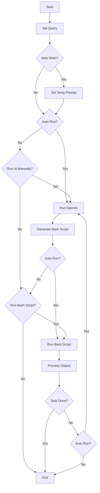
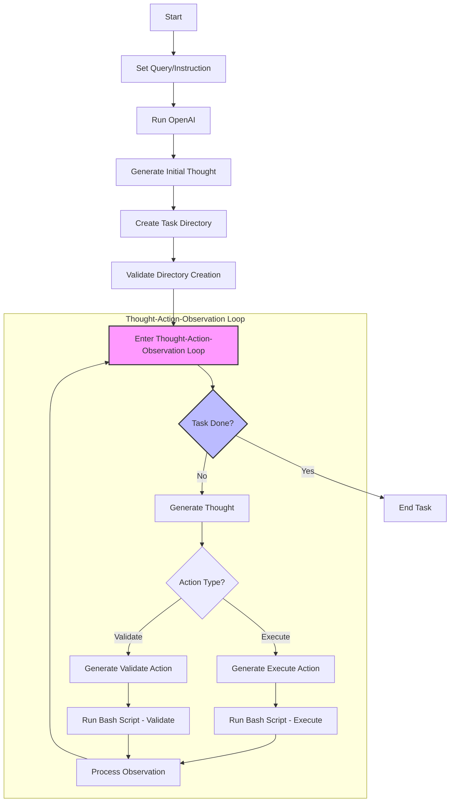

## LLM-Bash-Agent

LLM Bash Agent is an AI Agent that uses Bash Script/Shell commands to automate your computer

## Demo

In this demo, we use LLM Bash Agent to generate the backend.

https://github.com/user-attachments/assets/cd550321-9582-47b0-832b-59becd1d8054

## Getting Started

Set up Key Globally:

- In your `~/.bash_profile` or other type of shell profile
- OpenAI: Add `export OPENAI_API_KEY='YOUR_KEY'`
- Groq: Add `export GROQ_API_KEY='YOUR_KEY'`

Setup the `.env` file:

- Create a `.env` file in the root directory
- Add the following:

```bash
OPENAI_API_KEY=YOUR_KEY
GROQ_API_KEY=YOUR_KEY
```

Install:

```bash
npm install
#or
yarn
```

Run the development server:

```bash
npm run dev
# or
yarn dev
# or
pnpm dev
# or
bun dev
```

Open [http://localhost:3201](http://localhost:3201) with your browser to see the result.

## Setup Vector Database

[Qdrant](https://qdrant.tech/documentation/quickstart/)

```bash
docker pull qdrant/qdrant
docker run -p 6333:6333 -p 6334:6334 \
    -v $(pwd)/qdrant_storage:/qdrant/storage:z \
    qdrant/qdrant
```

## Diagrams

### Core functinality



### AI Functionality



## Example prompts

- For example prompts, please refer to the [examples/test.md](examples/test.md) file.
- For ReAct prompts, please refer to the [examples/prompt.md](examples/prompt.md) file.

## TODO

- [ ] Add custom fix agent for [React FE task](data/success/long_fix_create_react_fe_login_page_and_started_at_port_3504_1728830237432.json)
- [ ] Add few shot prompt for set up React Frontend [React FE task](data/success/long_fix_create_react_fe_login_page_and_started_at_port_3504_1728830237432.json)
- [ ] Edit prompt to write code first before run
- [ ] Edit prompt to check if the code is correct before run
- [ ] Edit prompt to check `tree`
