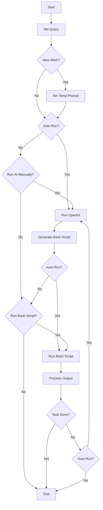
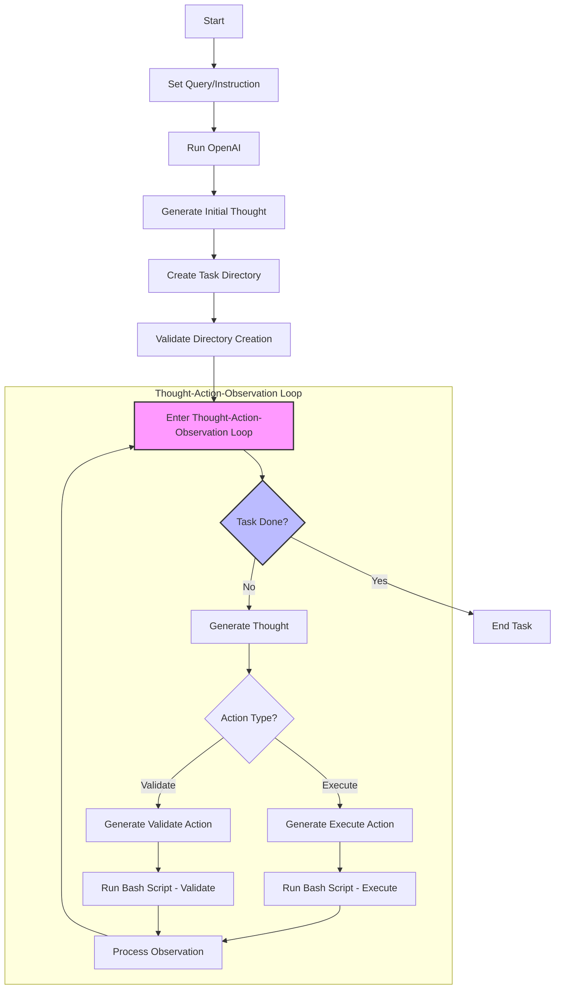

## Getting Started

Set up Key:

- In your `~/.bash_profile` or other type of shell profile
- OpenAI: Add `export OPENAI_API_KEY='YOUR_KEY'`
- Groq: Add `export GROQ_API_KEY='YOUR_KEY'`

Install:

```bash
npm install
#or
yarn
```

Run the development server:

```bash
npm run dev
# or
yarn dev
# or
pnpm dev
# or
bun dev
```

Open [http://localhost:3201](http://localhost:3201) with your browser to see the result.

## Diagrams



    - [ ] AI Internal Functionality:



## Example prompts

For example prompts, please refer to the [Readme-examples.md](Readme-examples.md) file.
