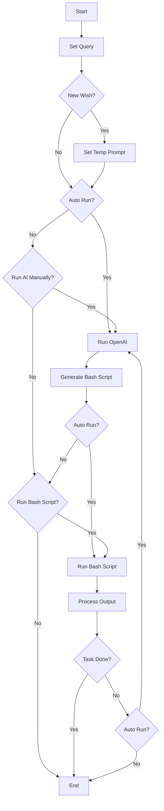
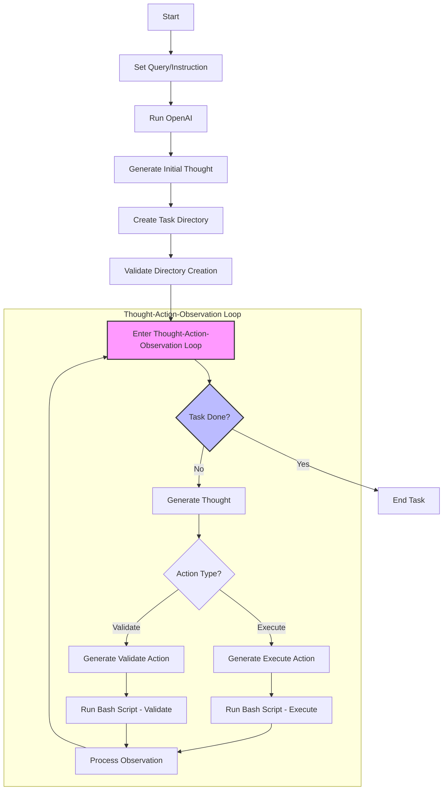

# Shell Agent

LLM Shell Agent is an AI Agent that uses Shell commands to automate your computer

- Here is how shell agent works: currently there are two steps.

  1. OpenAI to generate the shell commands. We apply [ReACt prompting technique](#references)([with Verification step by step](#references)) and OpenAI structure output to generate json object that contains the shell commands. [See examples](../data/success/)
  2. We run the shell commands on the computer. Then we feed the result back to the OpenAI to generate the next shell commands.
  3. We repeat the process until the task is done.

- How to use it?

1. Very simple you just input the task you want the agent to do and click "Run AI" button.
2. Observing the output and decide to run the command or not. If you decide to run the command, click "Run Bash Script" button.
3. After you familiar with the concept feel free to refresh then activate the "Auto Run" button.

- Demo: In this demo, we use LLM Bash Agent to generate the backend.

https://github.com/user-attachments/assets/cd550321-9582-47b0-832b-59becd1d8054

- Core functionality

- Shell Agent Functionality

- Example prompts

  - For example prompts, please refer to the [examples/test.md](examples/test.md) file.
  - For ReAct prompts, please refer to the [examples/prompt.md](examples/prompt.md) file.

## TODO

- [ ] Add custom fix agent for [React FE task](data/success/long_fix_create_react_fe_login_page_and_started_at_port_3504_1728830237432.json)
- [ ] Add few shot prompt for set up React Frontend [React FE task](data/success/long_fix_create_react_fe_login_page_and_started_at_port_3504_1728830237432.json)
- [ ] Edit prompt to write code first before run
- [ ] Edit prompt to check if the code is correct before run
- [ ] Edit prompt to check `tree`
- [ ] load prompt from file
- [ ] Load and select example from Qdrant vector database

## References

- [ReAct: Prompting with React](https://react-lm.github.io/)
- [Let's Verify Step by Step](https://arxiv.org/abs/2305.20050)
